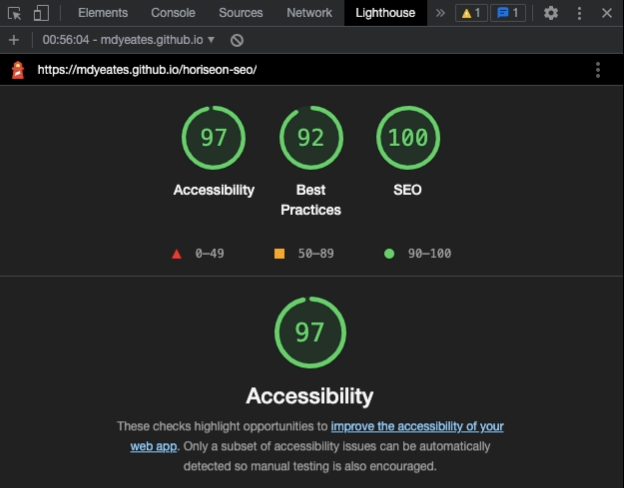

# Horiseon Website Application

## Description

This project was an on-the-job ticket to improve accessibility. 

Search engines such as Google have evolved, making semantic search essential for Search Engine Optimisation (SEO). 

This application was created for a marketing agency that follows accessibility standards and to ensure that their website is optimised for search engines. 

Furthermore, I improved the codebase by ensuring all links are functioning correctly, logically structuring semantic HTML elements, consolidating the CSS selectors, adding comments to improve readability, and including a descriptive title to improve search engine optimisation and accessibility. 

[A link to the deployed website](https://mdyeates.github.io/horiseon-seo/)

## Installation

N/A

## Usage

Individuals with vision impairment would be able to use this website with a screen reader.

To review the semantic HTML elements on this page without a screen reader, you can view the code in GitHub or open the deployed website and access Chrome DevTools. You can open Chrome DevTools by pressing Command+Options+I (macOS) or Control+Shift+I (Windows). A console panel should open below or to the side of the webpage in the browser. There you will see semantic HTML elements such as header, main, section, aside or footer.

Furthermore, you can run an accessibility and SEO audit with the use of Lighthouse in Chrome DevTools. 
This website scored 97 for accessibility, 92 for best practices and 100 for SEO. 

## Credits

This application was built using these resources:

[HTML Cheat Sheet](https://websitesetup.org/wp-content/uploads/2019/10/WSU-HTML-Cheat-Sheet.pdf)

[Why Use Semantic HTML](https://www.thoughtco.com/why-use-semantic-html-3468271)

[Semantic HTML Elements](https://www.w3schools.com/html/html5_semantic_elements.asp)

## Contact

## License

For more information, please refer to the LICENSE in the repo.
