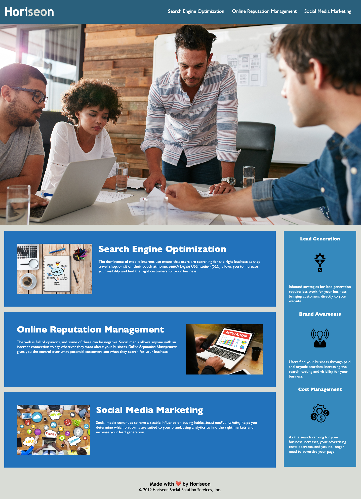

# Horiseon Website Application

## Description

This project was an on-the-job ticket to improve accessibility. 

Search engines such as Google have evolved, making semantic search essential for Search Engine Optimisation. 

This application was created for a marketing agency that follows accessibility standards and to ensure that their website is optimised for search engines. 

Furthermore, I improved the codebase by ensuring all links are functioning correctly, logically structuring semantic HTML elements, consolidating the CSS selectors, adding comments to improve readability, and including a descriptive title to improve search engine optimisation and accessibility. 

## Installation

N/A

## Usage

Individuals with vision impairment would be able to use this website with a screen reader.

To review the semantic HTML elements on this page without a screen reader, you can view the code in GitHub or open the deployed website. 

To review the code on the website you can open Chrome DevTools by pressing Command+Options+I (macOS) or Control+Shift+I (Windows). A console panel should open below or to the side of the webpage in the browser.
There you will see semantic HTML elements such as header, main, section, aside or footer.

 

## Credits

This application was built using these resources:

[HTML Cheat Sheet](https://websitesetup.org/wp-content/uploads/2019/10/WSU-HTML-Cheat-Sheet.pdf)

[Why Use Semantic HTML](https://www.thoughtco.com/why-use-semantic-html-3468271)

[Semantic HTML Elements](https://www.w3schools.com/html/html5_semantic_elements.asp)

## License

Please refer to the LICENSE in the repo.
